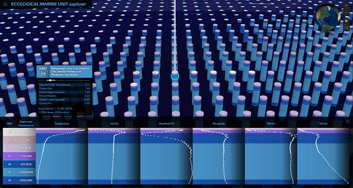

# Exploring Ecological Marine Units

The [Ecological Marine Units Explorer](http://livingatlas.arcgis.com/emu/) portrays a 3-dimensional classification of physiographic and ecological information about ocean water. 

Choose any ocean location to see these statistically-unique marine slices from sea level down to the ocean floor.

[](http://livingatlas.arcgis.com/emu/)

## Instructions

Before we begin, make sure you have a fresh version of [Node.js](https://nodejs.org/en/) and NPM installed. The current Long Term Support (LTS) release is an ideal starting point. 

To begin, clone this repository to your computer:

```sh
https://github.com/Esri/ecological-marine-units-explorer.git
```

From the project's root directory, install the required packages (dependencies):

```sh
npm install
```

## Running the app 
Now you can start the webpack dev server to test the app on your local machine:

```sh
# it will start a server instance and begin listening for connections from localhost on port 8080
npm run start
```

## Deployment
To build the app, you can simply run:

```sh
# it will place all files needed for deployment into the /build directory 
npm run build
```

## Requirements
- [ArcGIS API for JavaScript (4.24)](https://developers.arcgis.com/javascript/index.html)

## Resources
The Ecological Marine Units project is an innovative public-private partnership led by Esri and the USGS.
[](http://www.esri.com/~/media/Images/Content/Ecological-Marine-Units/logos)

[Ecological Marine Units] website

## Issues

Find a bug or want to request a new feature?  Please let us know by submitting an issue.

## Contributing

Esri welcomes contributions from anyone and everyone. Please see our [guidelines for contributing](https://github.com/esri/contributing).

## Licensing
Licensed under the Apache License, Version 2.0 (the "License");
you may not use this file except in compliance with the License.
You may obtain a copy of the License at

   http://www.apache.org/licenses/LICENSE-2.0

Unless required by applicable law or agreed to in writing, software
distributed under the License is distributed on an "AS IS" BASIS,
WITHOUT WARRANTIES OR CONDITIONS OF ANY KIND, either express or implied.
See the License for the specific language governing permissions and
limitations under the License.

A copy of the license is available in the repository's [LICENSE](LICENSE) file.

[//]: # (These are reference links used in the body of this note and get stripped out when the markdown processor does its job. There is no need to format nicely because it shouldn't be seen. Thanks SO - http://stackoverflow.com/questions/4823468/store-comments-in-markdown-syntax)

   [Ecological Marine Units]: <http://www.esri.com/ecological-marine-units>
   [Ecological Marine Units Explorer]: <http://livingatlas.arcgis.com/emu/>
